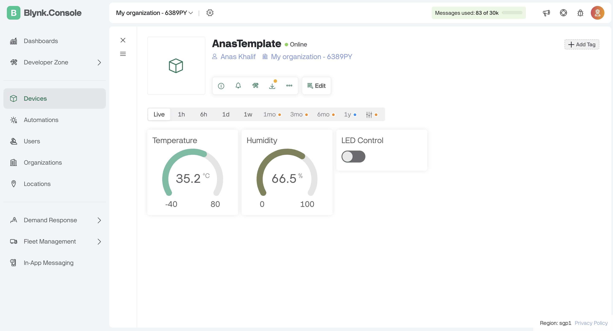

# ESP32 IoT dengan Blynk dan DHT22

🚀 **Proyek IoT menggunakan ESP32, Blynk, dan sensor DHT22 untuk membaca suhu & kelembaban, serta mengontrol LED dari aplikasi Blynk.**

## 📡 Fitur

- Membaca **suhu dan kelembaban** dari sensor **DHT22**
- Mengirim data ke **Blynk Cloud** melalui **WiFi**
- Menampilkan suhu & kelembaban di aplikasi **Blynk**
- Mengontrol **LED** melalui aplikasi Blynk
- Menggunakan **Wokwi** sebagai simulator

## 🛠️ Peralatan yang Dibutuhkan

- **ESP32 Devkit V1**
- **Sensor DHT22**
- **LED (Merah)**
- **Resistor 1KΩ**
- **Koneksi dengan Wokwi (simulator online)**

## 📡 Konfigurasi Data Stream di Blynk

| Nama        | Virtual Pin | Tipe    | Min | Max | Akses        |
| ----------- | ----------- | ------- | --- | --- | ------------ |
| Temperature | V0          | Double  | -40 | 80  | Read Only    |
| Humidity    | V1          | Double  | 0   | 100 | Read Only    |
| LED Control | V2          | Integer | 0   | 1   | Read & Write |
| LED Status  | V3          | Integer | 0   | 1   | Read Only    |

## 🚀 Cara Menggunakan

1. **Clone repository ini**
   ```sh
   git clone https://github.com/username/repository.git
   cd repository
   ```

## 📷 Hasil

| Tampilan Blynk       | Hasil Simulasi          |
| -------------------- | ----------------------- |
|  |  |
